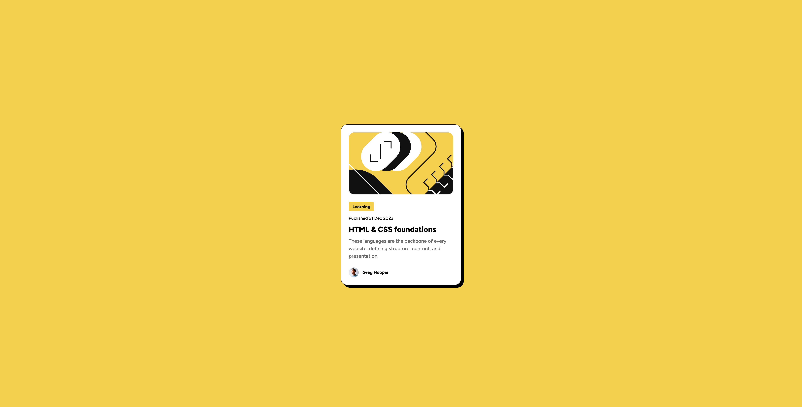

# Frontend Mentor - Blog preview card solution

This is a solution to the [Blog preview card challenge on Frontend Mentor](https://www.frontendmentor.io/challenges/blog-preview-card-ckPaj01IcS). Frontend Mentor challenges help you improve your coding skills by building realistic projects.

## Table of contents

- [Frontend Mentor - Blog preview card solution](#frontend-mentor---blog-preview-card-solution)
  - [Table of contents](#table-of-contents)
  - [Overview](#overview)
    - [The challenge](#the-challenge)
    - [Screenshot](#screenshot)
    - [Links](#links)
  - [My process](#my-process)
    - [Built with](#built-with)
    - [What I learned](#what-i-learned)
  - [Author](#author)

## Overview

### The challenge

Users should be able to:

- See hover and focus states for all interactive elements on the page

### Screenshot



### Links

- Solution URL: [https://github.com/FR-UX-EN/blog-preview-card](https://github.com/FR-UX-EN/blog-preview-card)
- Live Site URL: [https://fr-ux-en.github.io/blog-preview-card/](https://fr-ux-en.github.io/blog-preview-card/)

## My process

### Built with

- Semantic HTML5 markup
- CSS custom properties
- Flexbox

### What I learned

```html
<h1>Some HTML code I'm proud of</h1>
```

```css
@font-face {
  font-family: 'Figtree';
  src: url(assets/fonts/static/Figtree-Medium.ttf);
  font-weight: 500;
  font-style: normal;
  font-display: swap;
}

.container {
  box-shadow: 0 4px 8px rgba(0, 0, 0, 0.1);
  /* x-offset, y-offset, blur-radius, color */
}

h1 {
  font-size: clamp(1.5rem, 2vw + 1rem, 3rem);
}
/* 
  Fluid type scale using clamp() 
  - 1.5rem: the minimum size on small screens
  - 2vw + 1rem: the **fluid part** that scales with viewport width
  - 3rem: the maximum size on large screens
*/

p:nth-of-type(n) {
  /*  
    matches every element that is the nth child, of the same type (tag name), of its parent. 
    if n = 1, then the first p
    n could be number/index/formula/a keyword(odd, even)
  */
}
```

## Author

- LinkedIn - [Daniel Lee](https://www.linkedin.com/in/uniqueimaginate/)
- Frontend Mentor - [@FR-UX-EN](https://www.frontendmentor.io/profile/FR-UX-EN)
